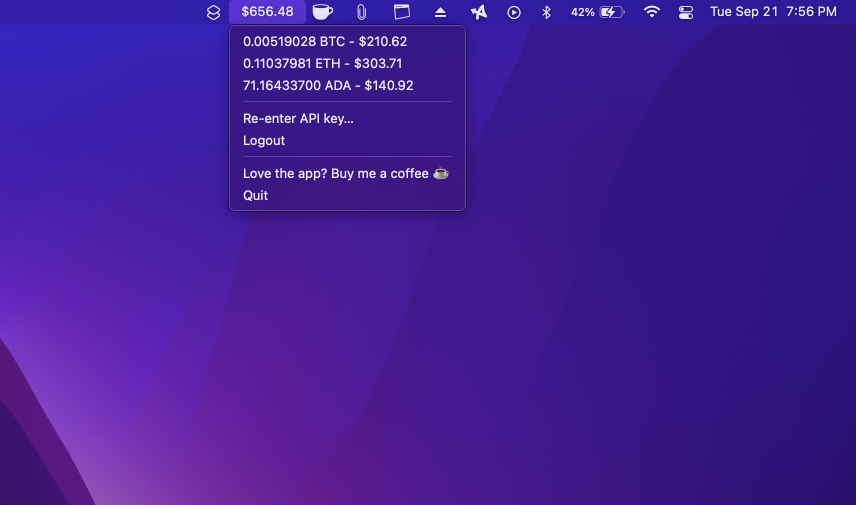

# realtime-coinbase-wallet

Reatlime Coinbase Wallet is a macOS menu bar application for Coinbase users to display their portfolio in real time.

## Install

1. Download the latest app.zip from [releases](https://github.com/akump/realtime-coinbase-wallet/releases)
2. Unzip app.zip
3. Drag the app to your Mac's application folder
4. Double click to open
5. If you run into permission issues, follow these steps
   1. Open the Apple menu, and click Preferences.
   2. Click Security & Privacy.
   3. Click the General tab.
   4. Click the lock in the lower right corner of the window.
   5. Enter your username and password when prompted, and click Unlock.
   6. Click the App Store and Identified Developers radial button.
   7. Look for “realtime-coin-wallet was blocked from opening because it is not from an identified developer” and click Open Anyway. (In older versions of macOS, you could click Anywhere and then click Allow From Anywhere.)
   8. Try rerunning the app.
6. Click the app from menu bar, and follow the suggested documentation on how to generate your API key

## Love the app?

[Support me by buying me a coffee](https://www.buymeacoffee.com/akump) ☕
